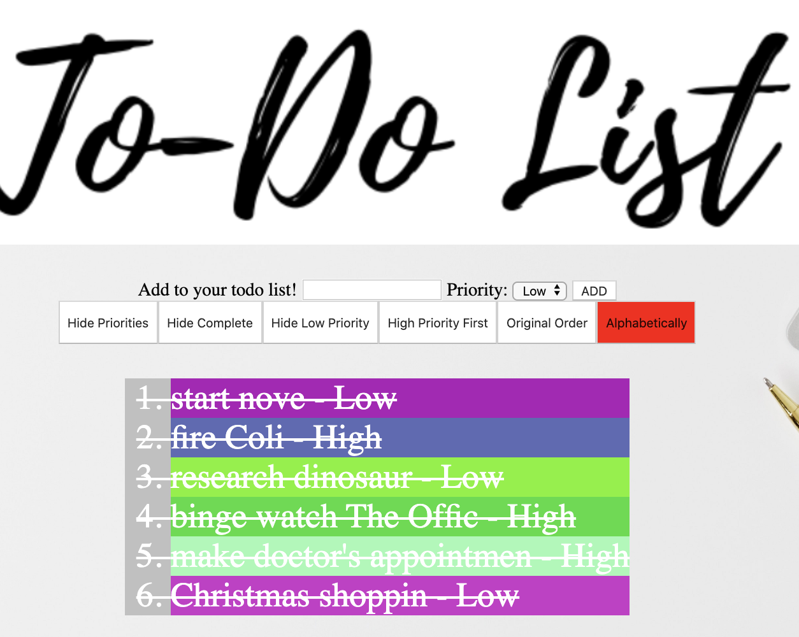

# Todata

### Welcome To Do List Beta

This is the basic you will be seeing when you first visit

### Functionality

The basic function of this site is add/edit your own ToDo List.

You can also sort the list in different orders you like.

### Basic Operation

You can insert your list through the input box, select the priority with drop down 'low/high' and then click the add button.

when you are done with the task you can simply click it to cross it out

### Sorting Your List

Hide/Show Priority - By clicking this button you can show or hide the priority of the task that you previously set next to the task so you can have a more clear view

Show/Hide Complete - By clicking this button you can show or hide the task/tasks you have completed

Show/Hide Low Priority - By clicking this button you can show or hide low priority task you have previously set

High Priority First - By clicking this button you can move the high priority task to the top of the list, click again to restore list back into original order

Complete Last - By clicking this button you can move the complete tasks to the bottom of the list and have a better view of which tasks are not complete

Alphabetically - By clicking this button you can sort the list in alphabetical order. However it's NOT RECOMMENDED to click this button the second time, operate under user's own risk!

